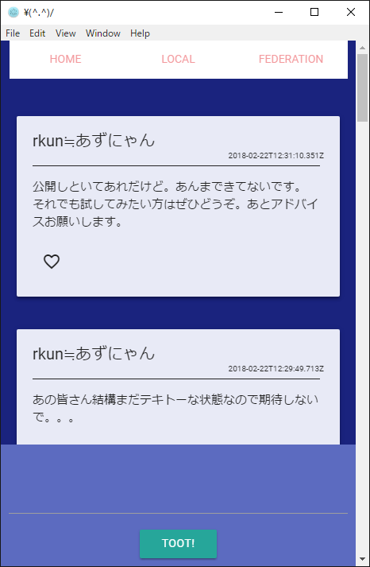
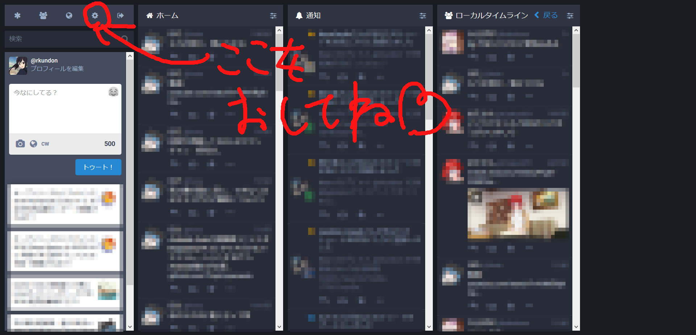
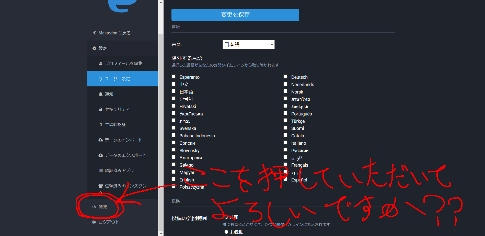
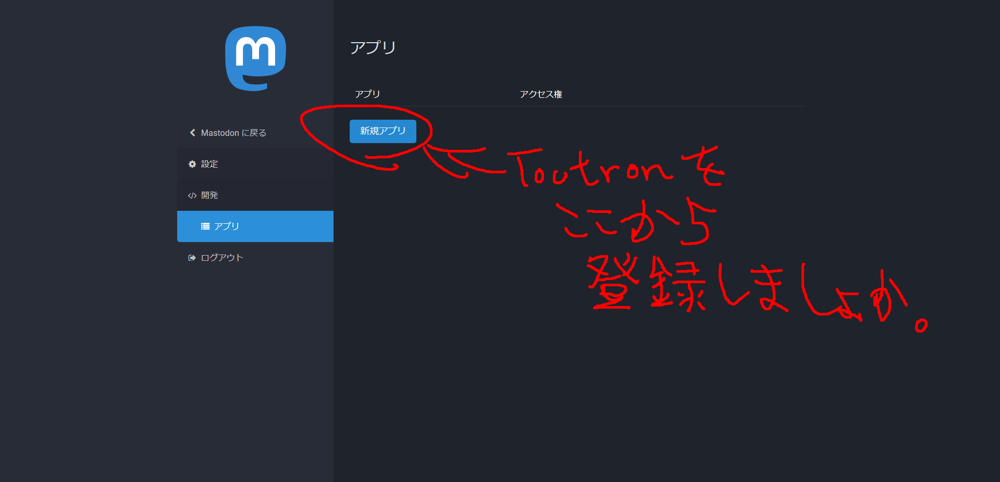
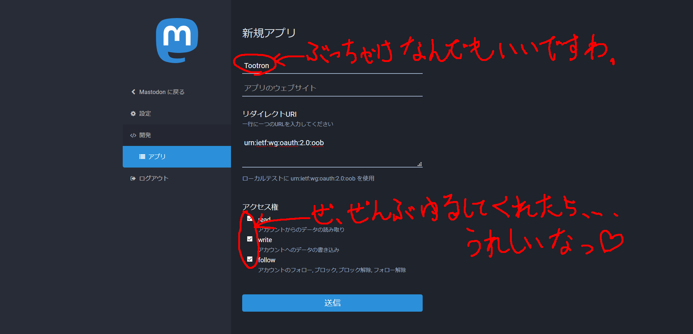
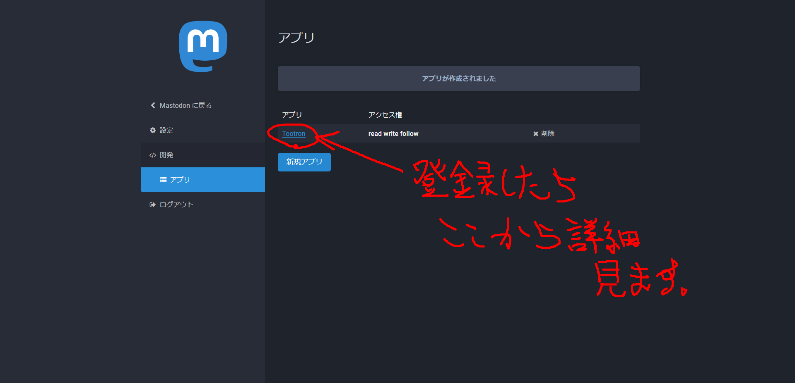
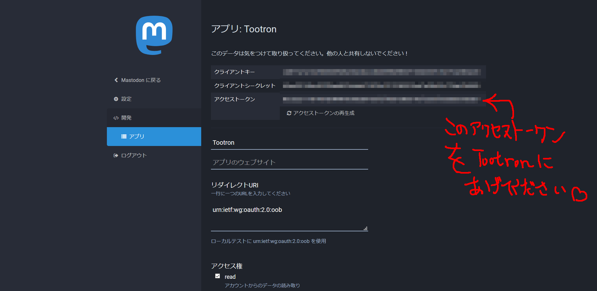
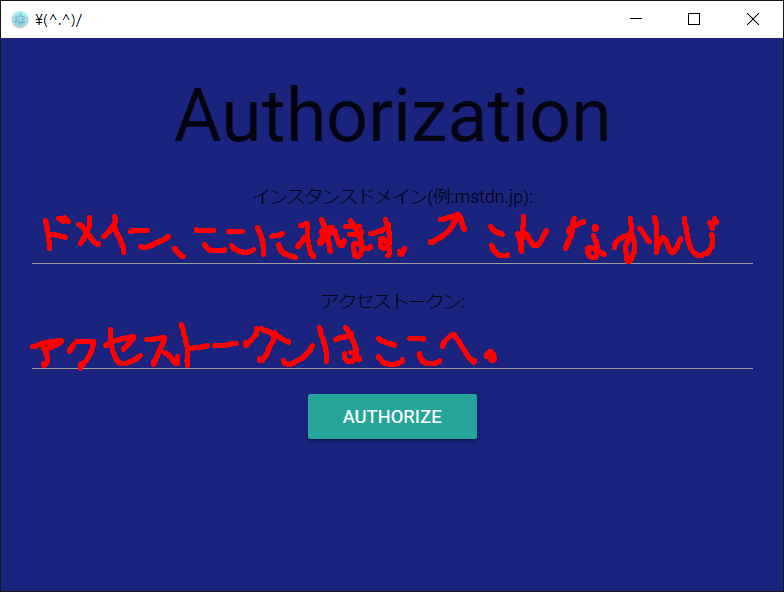

# Tootron
## なんなのこれ？
これは、Electron + Vue.jsなMastodonクライアントです。

## そもそもMastodonとは？
[Mastodon](https://joinmastodon.org/)とは、分散型ツイッ○ーでございます。
日本で結構普及してるようです。

たくさんのインスタンスと呼ばれるサーバーにそれぞれアカウントを作ります。それぞれのインスタンスは繋がていて、別インスタンスにあるアカウントと話すこともできます。

Tootronは、Mastodonで使えるネイティブクライアントとして開発してます。

## 使い方
```
> npm install
> npm start
```
とりあえずこれで動くはずでございます。

毎回、認証があります。セキュリティ的に記憶させるのが怖いからです。







Tootron起動してね。↓


めんどくさいです。
あとあと、メルアド&パスワードで入れるようにするまではごめんね。ベータ版ということで。

# なんかあれば
Mastodon:[@rkun](https://mstdn.maud.io/@rkun)へ言ってください。

とっても素人なんでアドバイスあればぜひ教えてください。お願いします。

今は、どういうふうにJSファイルを分けるかとか、悩んでます。。。

GitHubも初心者なのでぜひissueとかプルリクとか反応遅いかもしれませんけどご了承ください。すみません。

# TODO
- ストリーミング
- 認証時、メルアドとパスで入れるようにするかつセキュリティ強化。今は平文JSONにそのままアクセストークン記載なので気をつけてください。
- 画像トゥート